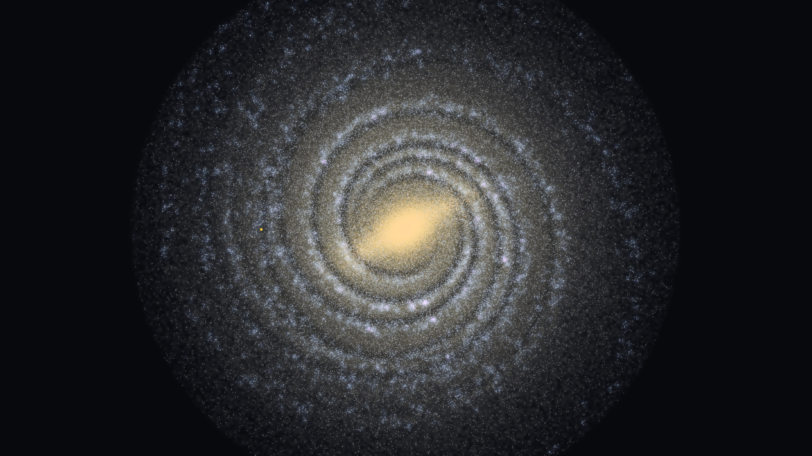
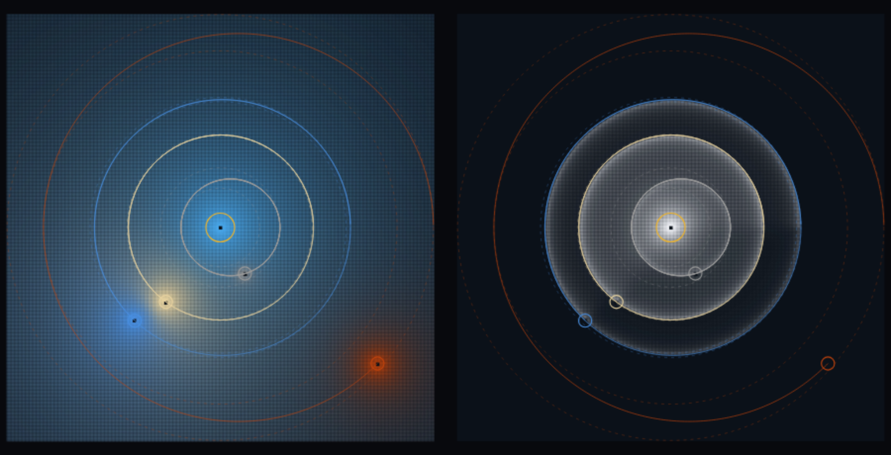

# OrbitMines: Physics Project

> [!NOTE] This is still a WIP, for progress see the writeup [here](https://physics.orbitmines-com.pages.dev/physics)

<div align="center">

</div>

---

Hi! In short this is a discrete and a subsequently derived continuous theory for physics. Specially theories for gravity, ...

For theory, you can start reading [here](https://orbitmines.com/physics). It walks you through all the concepts in this repository.

The remainder of this README is dedicated to explaining how you can use the physics libraries yourself!

<div align="center">

</div>

## What is in this repo

([implementation/ray](./implementation/ray/)) The project is implemented in a temporary - and bad at that - (auto-generated) version of an up and coming programming language I'm working on, it's there as a placeholder until that project is properly made. You can find that project @ [github.com/orbitmines/ray](https://github.com/orbitmines/ray).

([implementation/physics.ray](./implementation/physics.ray/)) The entire physics library is contained inside here.

([implementation/gen](./implementation/gen/)) From those two folders, a setup here automatically generates language implementations for other languages and backends you are likely to actually use.

([languages](./languages/)) The generated libraries for interacting with the theories for each specific programming language.

([theorems](./theorems/), [visuals](./visuals/), [data](./data/)) A list of theorems and visuals derived from the theories, and external data, used for the write-up @ [orbitmines.com/physics](https://orbitmines.com/physics).

*The entire point of the setup is that **everything** inside it follows from the rule definitions. The specified dynamics, whether run on CPU or GPU, run on a lattice or derived continuous model. That is why you'll find machinery to automatically derive all of that from the discrete rule definitions inside the theories. ([G.ray for instance](./implementation/physics.ray/theories/G/G.ray)). Subsequent edits to those theories, will thus downstream result in dynamics changes in the models that actually run based on those definitions.*

## Installation

<!-- gen:installation -->
While all the explanations here are for Python, packages exist for every language in the [languages/](./languages/) folder, each with its own README ([Python](./languages/physics.py/README.md), [TypeScript](./languages/physics.ts/README.md), [Ruby](./languages/physics.rb/README.md), [Java](./languages/physics.java/README.md), [C#](./languages/physics.cs/README.md), [Go](./languages/physics.go/README.md), [C++](./languages/physics.cpp/README.md), [Rust](./languages/physics.rs/README.md), [Lean](./languages/physics.lean/README.md), [Swift](./languages/physics.swift/README.md), [Julia](./languages/physics.jl/README.md), [R](./languages/physics.r/README.md), [Wolfram](./languages/physics.wl/README.md)).

```bash
# Python
pip install orbitmines-physics
```
<!-- /gen:installation -->

## Running simulations

```python

Theories.G

```

### Visualizations

### Running tests

## Making your own model

```python

```
