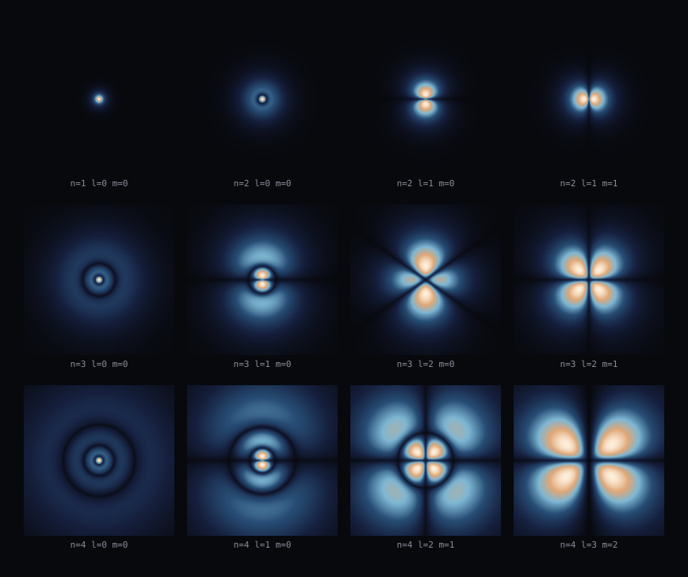
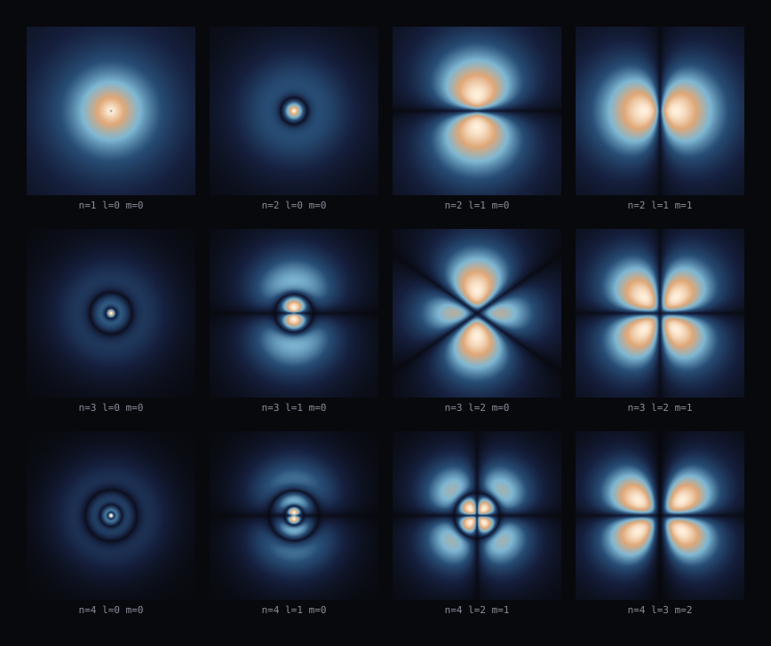

# atom.hydrogen

> one body biased one way, one the other. The sign law says what they pull with and the counting condition says what can stand in it - so how far out are the shells, and what does it take to get off one?

Proved under `G`, `G^XOR`, `G^XOR*2`, `G^XOR^c`, `G^XOR · relaxing(2/1)`. Generated by `implementations/.ts/src/theorems` - nothing here was written by hand: every premise is a count or an exact invariance taken from the theory itself, and the conclusion is what the inference rules made of them. [Open the page](index.html) to switch theory and lattice.

| theory | answer |
|---|---|
| `G` | no law follows |
| `G^XOR` | E_n ∝ \frac{1}{n^(2)} (and 1 other result) |
| `G^XOR*2` | E_n ∝ \frac{1}{n^(2)} (and 1 other result) |
| `G^XOR^c` | E_n ∝ \frac{1}{n^(2)} (and 1 other result) |
| `G^XOR · relaxing(2/1)` | E_n ∝ \frac{1}{n^(2)} (and 1 other result) |

## G

### the result

**no law follows for E_{n}**

| lattice | D | DEG | box | ticks |
|---|---|---|---|---|
| `fcc-12` | 3 | 12 | 21 | 120 |
| `cubic-6` | 3 | 6 | 21 | 120 |
| `square-4` | 2 | 4 | 41 | 120 |
| `line-2` | 1 | 2 | 61 | 120 |

**What was missing.** The rules needed these and no probe established them here:

- p^(2)r is conserved in flight
- E·r is conserved in flight
- E_n > 0

#### the derivation

There isn't one - the rules could reach no law from what the probes found.

#### what the runs found

**`fcc-12`**

`atom/where-the-centre-of-mass-is` - does not hold. G's rays carry no sign, so there is no bias, no sign law and no well - charge.attraction concludes nothing here and neither can this. Pure gravity has one sign of force and it does not bind a shell structure; the absence is what this theory says rather than something the run failed to find


**`cubic-6`**

`atom/where-the-centre-of-mass-is` - does not hold. G's rays carry no sign, so there is no bias, no sign law and no well - charge.attraction concludes nothing here and neither can this. Pure gravity has one sign of force and it does not bind a shell structure; the absence is what this theory says rather than something the run failed to find


**`square-4`**

`atom/where-the-centre-of-mass-is` - does not hold. G's rays carry no sign, so there is no bias, no sign law and no well - charge.attraction concludes nothing here and neither can this. Pure gravity has one sign of force and it does not bind a shell structure; the absence is what this theory says rather than something the run failed to find


**`line-2`**

`atom/where-the-centre-of-mass-is` - does not hold. G's rays carry no sign, so there is no bias, no sign law and no well - charge.attraction concludes nothing here and neither can this. Pure gravity has one sign of force and it does not bind a shell structure; the absence is what this theory says rather than something the run failed to find


## G^XOR

### result 1 of 2

**E_n ∝ \frac{1}{n^(2)}**

| lattice | D | DEG | box | ticks |
|---|---|---|---|---|
| `fcc-12` | 3 | 12 | 21 | 120 |
| `cubic-6` | 3 | 6 | 21 | 120 |



*the shells at one scale - where the centre of mass is found, on a plane through the middle, for the twelve lowest states - all twelve drawn at ONE scale, 777 cells across, so that the growth is the thing you see. Brightness is the density to the power a quarter, because the outer lobes are two decades under the inner ones. Nothing is drawn that was not solved: each panel is that state's own radial profile times the angular one, and both are the counting condition asked in the two directions a plane has - how many nodes fit across, and how many fit on the way round*



*the shells each at its own scale - the same twelve states with each panel scaled to its own extent, which is how these are usually drawn - it throws away the growth and shows the structure. The rings are the radial nodes, n - l - 1 of them, counted off the solution rather than imposed; the dark lines through the lobes are the angular ones, l - |m| across the axis and |m| round it. NOTE WHAT IS NOT HERE: no orbit, no circle, and nothing going round. What is drawn is where the thing IS, which is what a standing wave leaves behind and the only part of it that is not a matter of which tick you looked on*

#### the derivation

**E·r is the same on every shell**  
<sub>premise · atom/where-the-centre-of-mass-is</sub>  

and the same numbers read as an energy rather than as a balance: what is not kinetic is potential, the potential is the coupling over r, so E·r is the coupling again up to a factor that is the same on every shell. Measured, it moves by 0.00 per cent across n = 1 to 4. It is NOT a second measurement - it is the first one read the other way, and saying so is the difference between two premises and one premise counted twice

**E·r = E_n · r_n**  
<sub>definition · atom.hydrogen</sub>  

and the same coupling read as an energy: what is not kinetic is potential, the potential is the coupling over r, so an energy times a radius is that coupling again up to a factor which is also the same on every shell. This is not a second premise - it is the first one written the other way, which is why the run reports one measurement behind both

**E_n ∝ \frac{1}{r_n}**  
<sub>derived · balancing a conserved product</sub>  

```
E·r = E_n · r_n = constant
E_n·r_n = constant
E_n^(1) ∝ 1 / (r_n)
E_n ∝ \frac{1}{r_n}
```

E·r cannot change, and written out it is E_n·r_n. E_n carries the exponent 1 there, so holding the product fixed pins E_n to the rest raised to -1

**p^(2)r is the same on every shell**  
<sub>premise · atom/where-the-centre-of-mass-is</sub>  

what holds a thing in a circle is its momentum against the pull, and the pull here is the sign law's coupling over r^(2) - so p^(2)/r = g_q/r^(2) and p^(2)r is the coupling itself. THE COUPLING IS A PROPERTY OF THE TWO BODIES' BIASES AND OF NOTHING ELSE, so it cannot depend on which shell is being asked about - measured across the four lowest, it moves by 0.00 per cent

**p^(2)r = p · p · r_n**  
<sub>definition · atom.hydrogen</sub>  

and what the balance holds fixed is momentum twice and radius once. What keeps a thing on a curve goes as p^(2)/r and what pulls it goes as g_q/r^(2) - charge.attraction's coupling over charge.falloff's room - so setting the two equal leaves p^(2)r = g_q, with the inverse square already divided out. THE COUPLING IS A PROPERTY OF THE TWO BODIES' BIASES, so it is the same on every shell, and the run measured that rather than assuming it

**p ∝ \frac{n}{r_n}**  
<sub>definition · atom.hydrogen</sub>  

matter.debroglie established that a region holds a whole number of nodes and that this comes to p·r = n·pi·hbar. Neither pi nor hbar has anything to do with which shell is being asked about, so as a statement about how the momentum moves when the shell does, it is p ∝ n/r. The constants are not lost - they are in the line that is cited, and they set the SIZE of the atom rather than the shape of the ladder

**r_n ∝ n^(2)**  
<sub>derived · balancing a conserved product</sub>  

```
p^(2)r = p · p · r_n = constant
\frac{n^(2)}{r_n} = constant
r_n^(-1) ∝ 1 / (n^(2))
r_n ∝ n^(2)
```

p^(2)r cannot change, and written out it is \frac{nodes^(2)}{r_n}. r_n carries the exponent -1 there - it appears more than once, because the factors are not all independent of it, so holding the product fixed pins r_n to the rest raised to 1

**E_n ∝ \frac{1}{n^(2)}**  
<sub>derived · expansion</sub>  

r_n is not a primitive of this theory - it is what the line above shows it to be, so it stands in for itself here

#### what the runs found

**`fcc-12`**

`atom/where-the-centre-of-mass-is` - holds. the two laws together bind: 10 states stand in the well, each with n - l - 1 nodes in its radius - counted off its own solution, and whole in every one of them. The coupling comes out the same on every shell to 0.00 per cent, the mean radius goes as n^(2.001) and the energy as n^(-2.001). At ALIKE biases the coupling is nought, there is no well, and nothing is bound - which is the sign law's own prediction and the control this rests on

- g_q = 2 - 1 - P_a·P_b at P_a = +1 against P_b = -1, which is what an atom is: one body biased one way and one the other. Twice what unbiased matter of the same masses would feel, and it is charge.attraction's number rather than this probe's
- bound states at alike bias = 0 - the control, and it is the sign law with its teeth in: two bodies biased the SAME way have 1 - P_a·P_b = 0, so there is no well at all and nothing can stand in it. Nought here is the prediction; anything else would refute charge.attraction
- E at n = 1, l = 0 = -0.0009 - 0 nodes across, which is n - l - 1 = 0 - counted off the solution rather than imposed. Its mean radius is 36.0 cells and its outermost peak is at 24 - against n^(2) times the ground state's 24, which is 24
- E at n = 2, l = 0 = -0.0002 - 1 nodes across, which is n - l - 1 = 1 - counted off the solution rather than imposed. Its mean radius is 144.0 cells and its outermost peak is at 126 - against n^(2) times the ground state's 24, which is 96
- E at n = 2, l = 1 = -0.0002 - 0 nodes across, which is n - l - 1 = 0 - counted off the solution rather than imposed. Its mean radius is 120.0 cells and its outermost peak is at 96 - against n^(2) times the ground state's 24, which is 96
- E at n = 3, l = 0 = -0.0001 - 2 nodes across, which is n - l - 1 = 2 - counted off the solution rather than imposed. Its mean radius is 323.9 cells and its outermost peak is at 314 - against n^(2) times the ground state's 24, which is 216
- E at n = 3, l = 1 = -0.0001 - 1 nodes across, which is n - l - 1 = 1 - counted off the solution rather than imposed. Its mean radius is 300.0 cells and its outermost peak is at 288 - against n^(2) times the ground state's 24, which is 216
- E at n = 3, l = 2 = -0.0001 - 0 nodes across, which is n - l - 1 = 0 - counted off the solution rather than imposed. Its mean radius is 252.0 cells and its outermost peak is at 216 - against n^(2) times the ground state's 24, which is 216
- E at n = 4, l = 0 = -0.0001 - 3 nodes across, which is n - l - 1 = 3 - counted off the solution rather than imposed. Its mean radius is 575.9 cells and its outermost peak is at 591 - against n^(2) times the ground state's 24, which is 384
- E at n = 4, l = 1 = -0.0001 - 2 nodes across, which is n - l - 1 = 2 - counted off the solution rather than imposed. Its mean radius is 552.0 cells and its outermost peak is at 566 - against n^(2) times the ground state's 24, which is 384
- E at n = 4, l = 2 = -0.0001 - 1 nodes across, which is n - l - 1 = 1 - counted off the solution rather than imposed. Its mean radius is 504.0 cells and its outermost peak is at 509 - against n^(2) times the ground state's 24, which is 384
- E at n = 4, l = 3 = -0.0001 - 0 nodes across, which is n - l - 1 = 0 - counted off the solution rather than imposed. Its mean radius is 432.0 cells and its outermost peak is at 384 - against n^(2) times the ground state's 24, which is 384
- E·r = -0.0313 - E·r at n = 1, and across n = 1 to 4 it is -3.125e-2, -3.125e-2, -3.125e-2, -3.125e-2 - a spread of 0.00 per cent. IT DOES NOT DEPEND ON WHICH SHELL, which is the whole of what makes this one atom rather than a different force at every radius: the coupling is a property of the two bodies' biases and of nothing else
- p^(2)r = 0.0625 - p^(2)r at n = 1, taken as 2·(-E)·r since what is not potential is kinetic - across n = 1 to 4 it is 6.250e-2, 6.250e-2, 6.250e-2, 6.250e-2, a spread of 0.00 per cent. The same numbers as E·r read as the force balance rather than as the energy, and constant for the same reason
- slope of log|E| against log n = -2.0005 - over n = 1 to 4, worst residual 1.09e-4 in the log. Fitted here only to be reported: the law the prover concludes comes from the balance and the counting condition, and this is the check that the two agree
- slope of log r against log n = 2.0005 - over the same four, worst residual 1.09e-4
- states whose nodes came out whole = 10 - every one of them, and every count is exactly n - l - 1 - 0, 1, 0, 2, 1, 0, 3, 2, 1, 0 against 0, 1, 0, 2, 1, 0, 3, 2, 1, 0. Counted off each solution by watching it cross zero, not imposed: the integer is what the counting condition produces and this is where it is checked

**`cubic-6`**

`atom/where-the-centre-of-mass-is` - holds. the two laws together bind: 10 states stand in the well, each with n - l - 1 nodes in its radius - counted off its own solution, and whole in every one of them. The coupling comes out the same on every shell to 0.00 per cent, the mean radius goes as n^(2.001) and the energy as n^(-2.001). At ALIKE biases the coupling is nought, there is no well, and nothing is bound - which is the sign law's own prediction and the control this rests on

- g_q = 2 - 1 - P_a·P_b at P_a = +1 against P_b = -1, which is what an atom is: one body biased one way and one the other. Twice what unbiased matter of the same masses would feel, and it is charge.attraction's number rather than this probe's
- bound states at alike bias = 0 - the control, and it is the sign law with its teeth in: two bodies biased the SAME way have 1 - P_a·P_b = 0, so there is no well at all and nothing can stand in it. Nought here is the prediction; anything else would refute charge.attraction
- E at n = 1, l = 0 = -0.0009 - 0 nodes across, which is n - l - 1 = 0 - counted off the solution rather than imposed. Its mean radius is 36.0 cells and its outermost peak is at 24 - against n^(2) times the ground state's 24, which is 24
- E at n = 2, l = 0 = -0.0002 - 1 nodes across, which is n - l - 1 = 1 - counted off the solution rather than imposed. Its mean radius is 144.0 cells and its outermost peak is at 126 - against n^(2) times the ground state's 24, which is 96
- E at n = 2, l = 1 = -0.0002 - 0 nodes across, which is n - l - 1 = 0 - counted off the solution rather than imposed. Its mean radius is 120.0 cells and its outermost peak is at 96 - against n^(2) times the ground state's 24, which is 96
- E at n = 3, l = 0 = -0.0001 - 2 nodes across, which is n - l - 1 = 2 - counted off the solution rather than imposed. Its mean radius is 323.9 cells and its outermost peak is at 314 - against n^(2) times the ground state's 24, which is 216
- E at n = 3, l = 1 = -0.0001 - 1 nodes across, which is n - l - 1 = 1 - counted off the solution rather than imposed. Its mean radius is 300.0 cells and its outermost peak is at 288 - against n^(2) times the ground state's 24, which is 216
- E at n = 3, l = 2 = -0.0001 - 0 nodes across, which is n - l - 1 = 0 - counted off the solution rather than imposed. Its mean radius is 252.0 cells and its outermost peak is at 216 - against n^(2) times the ground state's 24, which is 216
- E at n = 4, l = 0 = -0.0001 - 3 nodes across, which is n - l - 1 = 3 - counted off the solution rather than imposed. Its mean radius is 575.9 cells and its outermost peak is at 591 - against n^(2) times the ground state's 24, which is 384
- E at n = 4, l = 1 = -0.0001 - 2 nodes across, which is n - l - 1 = 2 - counted off the solution rather than imposed. Its mean radius is 552.0 cells and its outermost peak is at 566 - against n^(2) times the ground state's 24, which is 384
- E at n = 4, l = 2 = -0.0001 - 1 nodes across, which is n - l - 1 = 1 - counted off the solution rather than imposed. Its mean radius is 504.0 cells and its outermost peak is at 509 - against n^(2) times the ground state's 24, which is 384
- E at n = 4, l = 3 = -0.0001 - 0 nodes across, which is n - l - 1 = 0 - counted off the solution rather than imposed. Its mean radius is 432.0 cells and its outermost peak is at 384 - against n^(2) times the ground state's 24, which is 384
- E·r = -0.0313 - E·r at n = 1, and across n = 1 to 4 it is -3.125e-2, -3.125e-2, -3.125e-2, -3.125e-2 - a spread of 0.00 per cent. IT DOES NOT DEPEND ON WHICH SHELL, which is the whole of what makes this one atom rather than a different force at every radius: the coupling is a property of the two bodies' biases and of nothing else
- p^(2)r = 0.0625 - p^(2)r at n = 1, taken as 2·(-E)·r since what is not potential is kinetic - across n = 1 to 4 it is 6.250e-2, 6.250e-2, 6.250e-2, 6.250e-2, a spread of 0.00 per cent. The same numbers as E·r read as the force balance rather than as the energy, and constant for the same reason
- slope of log|E| against log n = -2.0005 - over n = 1 to 4, worst residual 1.09e-4 in the log. Fitted here only to be reported: the law the prover concludes comes from the balance and the counting condition, and this is the check that the two agree
- slope of log r against log n = 2.0005 - over the same four, worst residual 1.09e-4
- states whose nodes came out whole = 10 - every one of them, and every count is exactly n - l - 1 - 0, 1, 0, 2, 1, 0, 3, 2, 1, 0 against 0, 1, 0, 2, 1, 0, 3, 2, 1, 0. Counted off each solution by watching it cross zero, not imposed: the integer is what the counting condition produces and this is where it is checked

### result 2 of 2

**no law follows for E_{n}**

| lattice | D | DEG | box | ticks |
|---|---|---|---|---|
| `square-4` | 2 | 4 | 41 | 120 |
| `line-2` | 1 | 2 | 61 | 120 |

**What was missing.** The rules needed these and no probe established them here:

- p^(2)r is conserved in flight
- E·r is conserved in flight
- E_n > 0

#### the derivation

There isn't one - the rules could reach no law from what the probes found.

#### what the runs found

**`square-4`**

`atom/where-the-centre-of-mass-is` - does not hold. square-4 has 2 dimensions, and charge.falloff makes the potential r^(-(D-2)) - which on 2 is a logarithm, not the 1/r this balance is built on. That is a different problem with a different ladder and it is not this theorem's; the inverse square is a fact about three dimensions and so is everything that follows from it


**`line-2`**

`atom/where-the-centre-of-mass-is` - does not hold. line-2 has 1 dimension, and charge.falloff makes the potential r^(-(D-2)) - which on 1 is a well that only gets deeper, not the 1/r this balance is built on. That is a different problem with a different ladder and it is not this theorem's; the inverse square is a fact about three dimensions and so is everything that follows from it


## G^XOR*2

### result 1 of 2

**E_n ∝ \frac{1}{n^(2)}**

| lattice | D | DEG | box | ticks |
|---|---|---|---|---|
| `fcc-12` | 3 | 12 | 21 | 120 |
| `cubic-6` | 3 | 6 | 21 | 120 |


*the shells at one scale - where the centre of mass is found, on a plane through the middle, for the twelve lowest states - all twelve drawn at ONE scale, 777 cells across, so that the growth is the thing you see. Brightness is the density to the power a quarter, because the outer lobes are two decades under the inner ones. Nothing is drawn that was not solved: each panel is that state's own radial profile times the angular one, and both are the counting condition asked in the two directions a plane has - how many nodes fit across, and how many fit on the way round*


*the shells each at its own scale - the same twelve states with each panel scaled to its own extent, which is how these are usually drawn - it throws away the growth and shows the structure. The rings are the radial nodes, n - l - 1 of them, counted off the solution rather than imposed; the dark lines through the lobes are the angular ones, l - |m| across the axis and |m| round it. NOTE WHAT IS NOT HERE: no orbit, no circle, and nothing going round. What is drawn is where the thing IS, which is what a standing wave leaves behind and the only part of it that is not a matter of which tick you looked on*

#### the derivation

**E·r is the same on every shell**  
<sub>premise · atom/where-the-centre-of-mass-is</sub>  

and the same numbers read as an energy rather than as a balance: what is not kinetic is potential, the potential is the coupling over r, so E·r is the coupling again up to a factor that is the same on every shell. Measured, it moves by 0.00 per cent across n = 1 to 4. It is NOT a second measurement - it is the first one read the other way, and saying so is the difference between two premises and one premise counted twice

**E·r = E_n · r_n**  
<sub>definition · atom.hydrogen</sub>  

and the same coupling read as an energy: what is not kinetic is potential, the potential is the coupling over r, so an energy times a radius is that coupling again up to a factor which is also the same on every shell. This is not a second premise - it is the first one written the other way, which is why the run reports one measurement behind both

**E_n ∝ \frac{1}{r_n}**  
<sub>derived · balancing a conserved product</sub>  

```
E·r = E_n · r_n = constant
E_n·r_n = constant
E_n^(1) ∝ 1 / (r_n)
E_n ∝ \frac{1}{r_n}
```

E·r cannot change, and written out it is E_n·r_n. E_n carries the exponent 1 there, so holding the product fixed pins E_n to the rest raised to -1

**p^(2)r is the same on every shell**  
<sub>premise · atom/where-the-centre-of-mass-is</sub>  

what holds a thing in a circle is its momentum against the pull, and the pull here is the sign law's coupling over r^(2) - so p^(2)/r = g_q/r^(2) and p^(2)r is the coupling itself. THE COUPLING IS A PROPERTY OF THE TWO BODIES' BIASES AND OF NOTHING ELSE, so it cannot depend on which shell is being asked about - measured across the four lowest, it moves by 0.00 per cent

**p^(2)r = p · p · r_n**  
<sub>definition · atom.hydrogen</sub>  

and what the balance holds fixed is momentum twice and radius once. What keeps a thing on a curve goes as p^(2)/r and what pulls it goes as g_q/r^(2) - charge.attraction's coupling over charge.falloff's room - so setting the two equal leaves p^(2)r = g_q, with the inverse square already divided out. THE COUPLING IS A PROPERTY OF THE TWO BODIES' BIASES, so it is the same on every shell, and the run measured that rather than assuming it

**p ∝ \frac{n}{r_n}**  
<sub>definition · atom.hydrogen</sub>  

matter.debroglie established that a region holds a whole number of nodes and that this comes to p·r = n·pi·hbar. Neither pi nor hbar has anything to do with which shell is being asked about, so as a statement about how the momentum moves when the shell does, it is p ∝ n/r. The constants are not lost - they are in the line that is cited, and they set the SIZE of the atom rather than the shape of the ladder

**r_n ∝ n^(2)**  
<sub>derived · balancing a conserved product</sub>  

```
p^(2)r = p · p · r_n = constant
\frac{n^(2)}{r_n} = constant
r_n^(-1) ∝ 1 / (n^(2))
r_n ∝ n^(2)
```

p^(2)r cannot change, and written out it is \frac{nodes^(2)}{r_n}. r_n carries the exponent -1 there - it appears more than once, because the factors are not all independent of it, so holding the product fixed pins r_n to the rest raised to 1

**E_n ∝ \frac{1}{n^(2)}**  
<sub>derived · expansion</sub>  

r_n is not a primitive of this theory - it is what the line above shows it to be, so it stands in for itself here

#### what the runs found

**`fcc-12`**

`atom/where-the-centre-of-mass-is` - holds. the two laws together bind: 10 states stand in the well, each with n - l - 1 nodes in its radius - counted off its own solution, and whole in every one of them. The coupling comes out the same on every shell to 0.00 per cent, the mean radius goes as n^(2.001) and the energy as n^(-2.001). At ALIKE biases the coupling is nought, there is no well, and nothing is bound - which is the sign law's own prediction and the control this rests on

- g_q = 2 - 1 - P_a·P_b at P_a = +1 against P_b = -1, which is what an atom is: one body biased one way and one the other. Twice what unbiased matter of the same masses would feel, and it is charge.attraction's number rather than this probe's
- bound states at alike bias = 0 - the control, and it is the sign law with its teeth in: two bodies biased the SAME way have 1 - P_a·P_b = 0, so there is no well at all and nothing can stand in it. Nought here is the prediction; anything else would refute charge.attraction
- E at n = 1, l = 0 = -0.0009 - 0 nodes across, which is n - l - 1 = 0 - counted off the solution rather than imposed. Its mean radius is 36.0 cells and its outermost peak is at 24 - against n^(2) times the ground state's 24, which is 24
- E at n = 2, l = 0 = -0.0002 - 1 nodes across, which is n - l - 1 = 1 - counted off the solution rather than imposed. Its mean radius is 144.0 cells and its outermost peak is at 126 - against n^(2) times the ground state's 24, which is 96
- E at n = 2, l = 1 = -0.0002 - 0 nodes across, which is n - l - 1 = 0 - counted off the solution rather than imposed. Its mean radius is 120.0 cells and its outermost peak is at 96 - against n^(2) times the ground state's 24, which is 96
- E at n = 3, l = 0 = -0.0001 - 2 nodes across, which is n - l - 1 = 2 - counted off the solution rather than imposed. Its mean radius is 323.9 cells and its outermost peak is at 314 - against n^(2) times the ground state's 24, which is 216
- E at n = 3, l = 1 = -0.0001 - 1 nodes across, which is n - l - 1 = 1 - counted off the solution rather than imposed. Its mean radius is 300.0 cells and its outermost peak is at 288 - against n^(2) times the ground state's 24, which is 216
- E at n = 3, l = 2 = -0.0001 - 0 nodes across, which is n - l - 1 = 0 - counted off the solution rather than imposed. Its mean radius is 252.0 cells and its outermost peak is at 216 - against n^(2) times the ground state's 24, which is 216
- E at n = 4, l = 0 = -0.0001 - 3 nodes across, which is n - l - 1 = 3 - counted off the solution rather than imposed. Its mean radius is 575.9 cells and its outermost peak is at 591 - against n^(2) times the ground state's 24, which is 384
- E at n = 4, l = 1 = -0.0001 - 2 nodes across, which is n - l - 1 = 2 - counted off the solution rather than imposed. Its mean radius is 552.0 cells and its outermost peak is at 566 - against n^(2) times the ground state's 24, which is 384
- E at n = 4, l = 2 = -0.0001 - 1 nodes across, which is n - l - 1 = 1 - counted off the solution rather than imposed. Its mean radius is 504.0 cells and its outermost peak is at 509 - against n^(2) times the ground state's 24, which is 384
- E at n = 4, l = 3 = -0.0001 - 0 nodes across, which is n - l - 1 = 0 - counted off the solution rather than imposed. Its mean radius is 432.0 cells and its outermost peak is at 384 - against n^(2) times the ground state's 24, which is 384
- E·r = -0.0313 - E·r at n = 1, and across n = 1 to 4 it is -3.125e-2, -3.125e-2, -3.125e-2, -3.125e-2 - a spread of 0.00 per cent. IT DOES NOT DEPEND ON WHICH SHELL, which is the whole of what makes this one atom rather than a different force at every radius: the coupling is a property of the two bodies' biases and of nothing else
- p^(2)r = 0.0625 - p^(2)r at n = 1, taken as 2·(-E)·r since what is not potential is kinetic - across n = 1 to 4 it is 6.250e-2, 6.250e-2, 6.250e-2, 6.250e-2, a spread of 0.00 per cent. The same numbers as E·r read as the force balance rather than as the energy, and constant for the same reason
- slope of log|E| against log n = -2.0005 - over n = 1 to 4, worst residual 1.09e-4 in the log. Fitted here only to be reported: the law the prover concludes comes from the balance and the counting condition, and this is the check that the two agree
- slope of log r against log n = 2.0005 - over the same four, worst residual 1.09e-4
- states whose nodes came out whole = 10 - every one of them, and every count is exactly n - l - 1 - 0, 1, 0, 2, 1, 0, 3, 2, 1, 0 against 0, 1, 0, 2, 1, 0, 3, 2, 1, 0. Counted off each solution by watching it cross zero, not imposed: the integer is what the counting condition produces and this is where it is checked

**`cubic-6`**

`atom/where-the-centre-of-mass-is` - holds. the two laws together bind: 10 states stand in the well, each with n - l - 1 nodes in its radius - counted off its own solution, and whole in every one of them. The coupling comes out the same on every shell to 0.00 per cent, the mean radius goes as n^(2.001) and the energy as n^(-2.001). At ALIKE biases the coupling is nought, there is no well, and nothing is bound - which is the sign law's own prediction and the control this rests on

- g_q = 2 - 1 - P_a·P_b at P_a = +1 against P_b = -1, which is what an atom is: one body biased one way and one the other. Twice what unbiased matter of the same masses would feel, and it is charge.attraction's number rather than this probe's
- bound states at alike bias = 0 - the control, and it is the sign law with its teeth in: two bodies biased the SAME way have 1 - P_a·P_b = 0, so there is no well at all and nothing can stand in it. Nought here is the prediction; anything else would refute charge.attraction
- E at n = 1, l = 0 = -0.0009 - 0 nodes across, which is n - l - 1 = 0 - counted off the solution rather than imposed. Its mean radius is 36.0 cells and its outermost peak is at 24 - against n^(2) times the ground state's 24, which is 24
- E at n = 2, l = 0 = -0.0002 - 1 nodes across, which is n - l - 1 = 1 - counted off the solution rather than imposed. Its mean radius is 144.0 cells and its outermost peak is at 126 - against n^(2) times the ground state's 24, which is 96
- E at n = 2, l = 1 = -0.0002 - 0 nodes across, which is n - l - 1 = 0 - counted off the solution rather than imposed. Its mean radius is 120.0 cells and its outermost peak is at 96 - against n^(2) times the ground state's 24, which is 96
- E at n = 3, l = 0 = -0.0001 - 2 nodes across, which is n - l - 1 = 2 - counted off the solution rather than imposed. Its mean radius is 323.9 cells and its outermost peak is at 314 - against n^(2) times the ground state's 24, which is 216
- E at n = 3, l = 1 = -0.0001 - 1 nodes across, which is n - l - 1 = 1 - counted off the solution rather than imposed. Its mean radius is 300.0 cells and its outermost peak is at 288 - against n^(2) times the ground state's 24, which is 216
- E at n = 3, l = 2 = -0.0001 - 0 nodes across, which is n - l - 1 = 0 - counted off the solution rather than imposed. Its mean radius is 252.0 cells and its outermost peak is at 216 - against n^(2) times the ground state's 24, which is 216
- E at n = 4, l = 0 = -0.0001 - 3 nodes across, which is n - l - 1 = 3 - counted off the solution rather than imposed. Its mean radius is 575.9 cells and its outermost peak is at 591 - against n^(2) times the ground state's 24, which is 384
- E at n = 4, l = 1 = -0.0001 - 2 nodes across, which is n - l - 1 = 2 - counted off the solution rather than imposed. Its mean radius is 552.0 cells and its outermost peak is at 566 - against n^(2) times the ground state's 24, which is 384
- E at n = 4, l = 2 = -0.0001 - 1 nodes across, which is n - l - 1 = 1 - counted off the solution rather than imposed. Its mean radius is 504.0 cells and its outermost peak is at 509 - against n^(2) times the ground state's 24, which is 384
- E at n = 4, l = 3 = -0.0001 - 0 nodes across, which is n - l - 1 = 0 - counted off the solution rather than imposed. Its mean radius is 432.0 cells and its outermost peak is at 384 - against n^(2) times the ground state's 24, which is 384
- E·r = -0.0313 - E·r at n = 1, and across n = 1 to 4 it is -3.125e-2, -3.125e-2, -3.125e-2, -3.125e-2 - a spread of 0.00 per cent. IT DOES NOT DEPEND ON WHICH SHELL, which is the whole of what makes this one atom rather than a different force at every radius: the coupling is a property of the two bodies' biases and of nothing else
- p^(2)r = 0.0625 - p^(2)r at n = 1, taken as 2·(-E)·r since what is not potential is kinetic - across n = 1 to 4 it is 6.250e-2, 6.250e-2, 6.250e-2, 6.250e-2, a spread of 0.00 per cent. The same numbers as E·r read as the force balance rather than as the energy, and constant for the same reason
- slope of log|E| against log n = -2.0005 - over n = 1 to 4, worst residual 1.09e-4 in the log. Fitted here only to be reported: the law the prover concludes comes from the balance and the counting condition, and this is the check that the two agree
- slope of log r against log n = 2.0005 - over the same four, worst residual 1.09e-4
- states whose nodes came out whole = 10 - every one of them, and every count is exactly n - l - 1 - 0, 1, 0, 2, 1, 0, 3, 2, 1, 0 against 0, 1, 0, 2, 1, 0, 3, 2, 1, 0. Counted off each solution by watching it cross zero, not imposed: the integer is what the counting condition produces and this is where it is checked

### result 2 of 2

**no law follows for E_{n}**

| lattice | D | DEG | box | ticks |
|---|---|---|---|---|
| `square-4` | 2 | 4 | 41 | 120 |
| `line-2` | 1 | 2 | 61 | 120 |

**What was missing.** The rules needed these and no probe established them here:

- p^(2)r is conserved in flight
- E·r is conserved in flight
- E_n > 0

#### the derivation

There isn't one - the rules could reach no law from what the probes found.

#### what the runs found

**`square-4`**

`atom/where-the-centre-of-mass-is` - does not hold. square-4 has 2 dimensions, and charge.falloff makes the potential r^(-(D-2)) - which on 2 is a logarithm, not the 1/r this balance is built on. That is a different problem with a different ladder and it is not this theorem's; the inverse square is a fact about three dimensions and so is everything that follows from it


**`line-2`**

`atom/where-the-centre-of-mass-is` - does not hold. line-2 has 1 dimension, and charge.falloff makes the potential r^(-(D-2)) - which on 1 is a well that only gets deeper, not the 1/r this balance is built on. That is a different problem with a different ladder and it is not this theorem's; the inverse square is a fact about three dimensions and so is everything that follows from it


## G^XOR^c

### result 1 of 2

**E_n ∝ \frac{1}{n^(2)}**

| lattice | D | DEG | box | ticks |
|---|---|---|---|---|
| `fcc-12` | 3 | 12 | 21 | 120 |
| `cubic-6` | 3 | 6 | 21 | 120 |


*the shells at one scale - where the centre of mass is found, on a plane through the middle, for the twelve lowest states - all twelve drawn at ONE scale, 777 cells across, so that the growth is the thing you see. Brightness is the density to the power a quarter, because the outer lobes are two decades under the inner ones. Nothing is drawn that was not solved: each panel is that state's own radial profile times the angular one, and both are the counting condition asked in the two directions a plane has - how many nodes fit across, and how many fit on the way round*


*the shells each at its own scale - the same twelve states with each panel scaled to its own extent, which is how these are usually drawn - it throws away the growth and shows the structure. The rings are the radial nodes, n - l - 1 of them, counted off the solution rather than imposed; the dark lines through the lobes are the angular ones, l - |m| across the axis and |m| round it. NOTE WHAT IS NOT HERE: no orbit, no circle, and nothing going round. What is drawn is where the thing IS, which is what a standing wave leaves behind and the only part of it that is not a matter of which tick you looked on*

#### the derivation

**E·r is the same on every shell**  
<sub>premise · atom/where-the-centre-of-mass-is</sub>  

and the same numbers read as an energy rather than as a balance: what is not kinetic is potential, the potential is the coupling over r, so E·r is the coupling again up to a factor that is the same on every shell. Measured, it moves by 0.00 per cent across n = 1 to 4. It is NOT a second measurement - it is the first one read the other way, and saying so is the difference between two premises and one premise counted twice

**E·r = E_n · r_n**  
<sub>definition · atom.hydrogen</sub>  

and the same coupling read as an energy: what is not kinetic is potential, the potential is the coupling over r, so an energy times a radius is that coupling again up to a factor which is also the same on every shell. This is not a second premise - it is the first one written the other way, which is why the run reports one measurement behind both

**E_n ∝ \frac{1}{r_n}**  
<sub>derived · balancing a conserved product</sub>  

```
E·r = E_n · r_n = constant
E_n·r_n = constant
E_n^(1) ∝ 1 / (r_n)
E_n ∝ \frac{1}{r_n}
```

E·r cannot change, and written out it is E_n·r_n. E_n carries the exponent 1 there, so holding the product fixed pins E_n to the rest raised to -1

**p^(2)r is the same on every shell**  
<sub>premise · atom/where-the-centre-of-mass-is</sub>  

what holds a thing in a circle is its momentum against the pull, and the pull here is the sign law's coupling over r^(2) - so p^(2)/r = g_q/r^(2) and p^(2)r is the coupling itself. THE COUPLING IS A PROPERTY OF THE TWO BODIES' BIASES AND OF NOTHING ELSE, so it cannot depend on which shell is being asked about - measured across the four lowest, it moves by 0.00 per cent

**p^(2)r = p · p · r_n**  
<sub>definition · atom.hydrogen</sub>  

and what the balance holds fixed is momentum twice and radius once. What keeps a thing on a curve goes as p^(2)/r and what pulls it goes as g_q/r^(2) - charge.attraction's coupling over charge.falloff's room - so setting the two equal leaves p^(2)r = g_q, with the inverse square already divided out. THE COUPLING IS A PROPERTY OF THE TWO BODIES' BIASES, so it is the same on every shell, and the run measured that rather than assuming it

**p ∝ \frac{n}{r_n}**  
<sub>definition · atom.hydrogen</sub>  

matter.debroglie established that a region holds a whole number of nodes and that this comes to p·r = n·pi·hbar. Neither pi nor hbar has anything to do with which shell is being asked about, so as a statement about how the momentum moves when the shell does, it is p ∝ n/r. The constants are not lost - they are in the line that is cited, and they set the SIZE of the atom rather than the shape of the ladder

**r_n ∝ n^(2)**  
<sub>derived · balancing a conserved product</sub>  

```
p^(2)r = p · p · r_n = constant
\frac{n^(2)}{r_n} = constant
r_n^(-1) ∝ 1 / (n^(2))
r_n ∝ n^(2)
```

p^(2)r cannot change, and written out it is \frac{nodes^(2)}{r_n}. r_n carries the exponent -1 there - it appears more than once, because the factors are not all independent of it, so holding the product fixed pins r_n to the rest raised to 1

**E_n ∝ \frac{1}{n^(2)}**  
<sub>derived · expansion</sub>  

r_n is not a primitive of this theory - it is what the line above shows it to be, so it stands in for itself here

#### what the runs found

**`fcc-12`**

`atom/where-the-centre-of-mass-is` - holds. the two laws together bind: 10 states stand in the well, each with n - l - 1 nodes in its radius - counted off its own solution, and whole in every one of them. The coupling comes out the same on every shell to 0.00 per cent, the mean radius goes as n^(2.001) and the energy as n^(-2.001). At ALIKE biases the coupling is nought, there is no well, and nothing is bound - which is the sign law's own prediction and the control this rests on

- g_q = 2 - 1 - P_a·P_b at P_a = +1 against P_b = -1, which is what an atom is: one body biased one way and one the other. Twice what unbiased matter of the same masses would feel, and it is charge.attraction's number rather than this probe's
- bound states at alike bias = 0 - the control, and it is the sign law with its teeth in: two bodies biased the SAME way have 1 - P_a·P_b = 0, so there is no well at all and nothing can stand in it. Nought here is the prediction; anything else would refute charge.attraction
- E at n = 1, l = 0 = -0.0009 - 0 nodes across, which is n - l - 1 = 0 - counted off the solution rather than imposed. Its mean radius is 36.0 cells and its outermost peak is at 24 - against n^(2) times the ground state's 24, which is 24
- E at n = 2, l = 0 = -0.0002 - 1 nodes across, which is n - l - 1 = 1 - counted off the solution rather than imposed. Its mean radius is 144.0 cells and its outermost peak is at 126 - against n^(2) times the ground state's 24, which is 96
- E at n = 2, l = 1 = -0.0002 - 0 nodes across, which is n - l - 1 = 0 - counted off the solution rather than imposed. Its mean radius is 120.0 cells and its outermost peak is at 96 - against n^(2) times the ground state's 24, which is 96
- E at n = 3, l = 0 = -0.0001 - 2 nodes across, which is n - l - 1 = 2 - counted off the solution rather than imposed. Its mean radius is 323.9 cells and its outermost peak is at 314 - against n^(2) times the ground state's 24, which is 216
- E at n = 3, l = 1 = -0.0001 - 1 nodes across, which is n - l - 1 = 1 - counted off the solution rather than imposed. Its mean radius is 300.0 cells and its outermost peak is at 288 - against n^(2) times the ground state's 24, which is 216
- E at n = 3, l = 2 = -0.0001 - 0 nodes across, which is n - l - 1 = 0 - counted off the solution rather than imposed. Its mean radius is 252.0 cells and its outermost peak is at 216 - against n^(2) times the ground state's 24, which is 216
- E at n = 4, l = 0 = -0.0001 - 3 nodes across, which is n - l - 1 = 3 - counted off the solution rather than imposed. Its mean radius is 575.9 cells and its outermost peak is at 591 - against n^(2) times the ground state's 24, which is 384
- E at n = 4, l = 1 = -0.0001 - 2 nodes across, which is n - l - 1 = 2 - counted off the solution rather than imposed. Its mean radius is 552.0 cells and its outermost peak is at 566 - against n^(2) times the ground state's 24, which is 384
- E at n = 4, l = 2 = -0.0001 - 1 nodes across, which is n - l - 1 = 1 - counted off the solution rather than imposed. Its mean radius is 504.0 cells and its outermost peak is at 509 - against n^(2) times the ground state's 24, which is 384
- E at n = 4, l = 3 = -0.0001 - 0 nodes across, which is n - l - 1 = 0 - counted off the solution rather than imposed. Its mean radius is 432.0 cells and its outermost peak is at 384 - against n^(2) times the ground state's 24, which is 384
- E·r = -0.0313 - E·r at n = 1, and across n = 1 to 4 it is -3.125e-2, -3.125e-2, -3.125e-2, -3.125e-2 - a spread of 0.00 per cent. IT DOES NOT DEPEND ON WHICH SHELL, which is the whole of what makes this one atom rather than a different force at every radius: the coupling is a property of the two bodies' biases and of nothing else
- p^(2)r = 0.0625 - p^(2)r at n = 1, taken as 2·(-E)·r since what is not potential is kinetic - across n = 1 to 4 it is 6.250e-2, 6.250e-2, 6.250e-2, 6.250e-2, a spread of 0.00 per cent. The same numbers as E·r read as the force balance rather than as the energy, and constant for the same reason
- slope of log|E| against log n = -2.0005 - over n = 1 to 4, worst residual 1.09e-4 in the log. Fitted here only to be reported: the law the prover concludes comes from the balance and the counting condition, and this is the check that the two agree
- slope of log r against log n = 2.0005 - over the same four, worst residual 1.09e-4
- states whose nodes came out whole = 10 - every one of them, and every count is exactly n - l - 1 - 0, 1, 0, 2, 1, 0, 3, 2, 1, 0 against 0, 1, 0, 2, 1, 0, 3, 2, 1, 0. Counted off each solution by watching it cross zero, not imposed: the integer is what the counting condition produces and this is where it is checked

**`cubic-6`**

`atom/where-the-centre-of-mass-is` - holds. the two laws together bind: 10 states stand in the well, each with n - l - 1 nodes in its radius - counted off its own solution, and whole in every one of them. The coupling comes out the same on every shell to 0.00 per cent, the mean radius goes as n^(2.001) and the energy as n^(-2.001). At ALIKE biases the coupling is nought, there is no well, and nothing is bound - which is the sign law's own prediction and the control this rests on

- g_q = 2 - 1 - P_a·P_b at P_a = +1 against P_b = -1, which is what an atom is: one body biased one way and one the other. Twice what unbiased matter of the same masses would feel, and it is charge.attraction's number rather than this probe's
- bound states at alike bias = 0 - the control, and it is the sign law with its teeth in: two bodies biased the SAME way have 1 - P_a·P_b = 0, so there is no well at all and nothing can stand in it. Nought here is the prediction; anything else would refute charge.attraction
- E at n = 1, l = 0 = -0.0009 - 0 nodes across, which is n - l - 1 = 0 - counted off the solution rather than imposed. Its mean radius is 36.0 cells and its outermost peak is at 24 - against n^(2) times the ground state's 24, which is 24
- E at n = 2, l = 0 = -0.0002 - 1 nodes across, which is n - l - 1 = 1 - counted off the solution rather than imposed. Its mean radius is 144.0 cells and its outermost peak is at 126 - against n^(2) times the ground state's 24, which is 96
- E at n = 2, l = 1 = -0.0002 - 0 nodes across, which is n - l - 1 = 0 - counted off the solution rather than imposed. Its mean radius is 120.0 cells and its outermost peak is at 96 - against n^(2) times the ground state's 24, which is 96
- E at n = 3, l = 0 = -0.0001 - 2 nodes across, which is n - l - 1 = 2 - counted off the solution rather than imposed. Its mean radius is 323.9 cells and its outermost peak is at 314 - against n^(2) times the ground state's 24, which is 216
- E at n = 3, l = 1 = -0.0001 - 1 nodes across, which is n - l - 1 = 1 - counted off the solution rather than imposed. Its mean radius is 300.0 cells and its outermost peak is at 288 - against n^(2) times the ground state's 24, which is 216
- E at n = 3, l = 2 = -0.0001 - 0 nodes across, which is n - l - 1 = 0 - counted off the solution rather than imposed. Its mean radius is 252.0 cells and its outermost peak is at 216 - against n^(2) times the ground state's 24, which is 216
- E at n = 4, l = 0 = -0.0001 - 3 nodes across, which is n - l - 1 = 3 - counted off the solution rather than imposed. Its mean radius is 575.9 cells and its outermost peak is at 591 - against n^(2) times the ground state's 24, which is 384
- E at n = 4, l = 1 = -0.0001 - 2 nodes across, which is n - l - 1 = 2 - counted off the solution rather than imposed. Its mean radius is 552.0 cells and its outermost peak is at 566 - against n^(2) times the ground state's 24, which is 384
- E at n = 4, l = 2 = -0.0001 - 1 nodes across, which is n - l - 1 = 1 - counted off the solution rather than imposed. Its mean radius is 504.0 cells and its outermost peak is at 509 - against n^(2) times the ground state's 24, which is 384
- E at n = 4, l = 3 = -0.0001 - 0 nodes across, which is n - l - 1 = 0 - counted off the solution rather than imposed. Its mean radius is 432.0 cells and its outermost peak is at 384 - against n^(2) times the ground state's 24, which is 384
- E·r = -0.0313 - E·r at n = 1, and across n = 1 to 4 it is -3.125e-2, -3.125e-2, -3.125e-2, -3.125e-2 - a spread of 0.00 per cent. IT DOES NOT DEPEND ON WHICH SHELL, which is the whole of what makes this one atom rather than a different force at every radius: the coupling is a property of the two bodies' biases and of nothing else
- p^(2)r = 0.0625 - p^(2)r at n = 1, taken as 2·(-E)·r since what is not potential is kinetic - across n = 1 to 4 it is 6.250e-2, 6.250e-2, 6.250e-2, 6.250e-2, a spread of 0.00 per cent. The same numbers as E·r read as the force balance rather than as the energy, and constant for the same reason
- slope of log|E| against log n = -2.0005 - over n = 1 to 4, worst residual 1.09e-4 in the log. Fitted here only to be reported: the law the prover concludes comes from the balance and the counting condition, and this is the check that the two agree
- slope of log r against log n = 2.0005 - over the same four, worst residual 1.09e-4
- states whose nodes came out whole = 10 - every one of them, and every count is exactly n - l - 1 - 0, 1, 0, 2, 1, 0, 3, 2, 1, 0 against 0, 1, 0, 2, 1, 0, 3, 2, 1, 0. Counted off each solution by watching it cross zero, not imposed: the integer is what the counting condition produces and this is where it is checked

### result 2 of 2

**no law follows for E_{n}**

| lattice | D | DEG | box | ticks |
|---|---|---|---|---|
| `square-4` | 2 | 4 | 41 | 120 |
| `line-2` | 1 | 2 | 61 | 120 |

**What was missing.** The rules needed these and no probe established them here:

- p^(2)r is conserved in flight
- E·r is conserved in flight
- E_n > 0

#### the derivation

There isn't one - the rules could reach no law from what the probes found.

#### what the runs found

**`square-4`**

`atom/where-the-centre-of-mass-is` - does not hold. square-4 has 2 dimensions, and charge.falloff makes the potential r^(-(D-2)) - which on 2 is a logarithm, not the 1/r this balance is built on. That is a different problem with a different ladder and it is not this theorem's; the inverse square is a fact about three dimensions and so is everything that follows from it


**`line-2`**

`atom/where-the-centre-of-mass-is` - does not hold. line-2 has 1 dimension, and charge.falloff makes the potential r^(-(D-2)) - which on 1 is a well that only gets deeper, not the 1/r this balance is built on. That is a different problem with a different ladder and it is not this theorem's; the inverse square is a fact about three dimensions and so is everything that follows from it


## G^XOR · relaxing(2/1)

### result 1 of 2

**E_n ∝ \frac{1}{n^(2)}**

| lattice | D | DEG | box | ticks |
|---|---|---|---|---|
| `fcc-12` | 3 | 12 | 21 | 120 |
| `cubic-6` | 3 | 6 | 21 | 120 |


*the shells at one scale - where the centre of mass is found, on a plane through the middle, for the twelve lowest states - all twelve drawn at ONE scale, 777 cells across, so that the growth is the thing you see. Brightness is the density to the power a quarter, because the outer lobes are two decades under the inner ones. Nothing is drawn that was not solved: each panel is that state's own radial profile times the angular one, and both are the counting condition asked in the two directions a plane has - how many nodes fit across, and how many fit on the way round*


*the shells each at its own scale - the same twelve states with each panel scaled to its own extent, which is how these are usually drawn - it throws away the growth and shows the structure. The rings are the radial nodes, n - l - 1 of them, counted off the solution rather than imposed; the dark lines through the lobes are the angular ones, l - |m| across the axis and |m| round it. NOTE WHAT IS NOT HERE: no orbit, no circle, and nothing going round. What is drawn is where the thing IS, which is what a standing wave leaves behind and the only part of it that is not a matter of which tick you looked on*

#### the derivation

**E·r is the same on every shell**  
<sub>premise · atom/where-the-centre-of-mass-is</sub>  

and the same numbers read as an energy rather than as a balance: what is not kinetic is potential, the potential is the coupling over r, so E·r is the coupling again up to a factor that is the same on every shell. Measured, it moves by 0.00 per cent across n = 1 to 4. It is NOT a second measurement - it is the first one read the other way, and saying so is the difference between two premises and one premise counted twice

**E·r = E_n · r_n**  
<sub>definition · atom.hydrogen</sub>  

and the same coupling read as an energy: what is not kinetic is potential, the potential is the coupling over r, so an energy times a radius is that coupling again up to a factor which is also the same on every shell. This is not a second premise - it is the first one written the other way, which is why the run reports one measurement behind both

**E_n ∝ \frac{1}{r_n}**  
<sub>derived · balancing a conserved product</sub>  

```
E·r = E_n · r_n = constant
E_n·r_n = constant
E_n^(1) ∝ 1 / (r_n)
E_n ∝ \frac{1}{r_n}
```

E·r cannot change, and written out it is E_n·r_n. E_n carries the exponent 1 there, so holding the product fixed pins E_n to the rest raised to -1

**p^(2)r is the same on every shell**  
<sub>premise · atom/where-the-centre-of-mass-is</sub>  

what holds a thing in a circle is its momentum against the pull, and the pull here is the sign law's coupling over r^(2) - so p^(2)/r = g_q/r^(2) and p^(2)r is the coupling itself. THE COUPLING IS A PROPERTY OF THE TWO BODIES' BIASES AND OF NOTHING ELSE, so it cannot depend on which shell is being asked about - measured across the four lowest, it moves by 0.00 per cent

**p^(2)r = p · p · r_n**  
<sub>definition · atom.hydrogen</sub>  

and what the balance holds fixed is momentum twice and radius once. What keeps a thing on a curve goes as p^(2)/r and what pulls it goes as g_q/r^(2) - charge.attraction's coupling over charge.falloff's room - so setting the two equal leaves p^(2)r = g_q, with the inverse square already divided out. THE COUPLING IS A PROPERTY OF THE TWO BODIES' BIASES, so it is the same on every shell, and the run measured that rather than assuming it

**p ∝ \frac{n}{r_n}**  
<sub>definition · atom.hydrogen</sub>  

matter.debroglie established that a region holds a whole number of nodes and that this comes to p·r = n·pi·hbar. Neither pi nor hbar has anything to do with which shell is being asked about, so as a statement about how the momentum moves when the shell does, it is p ∝ n/r. The constants are not lost - they are in the line that is cited, and they set the SIZE of the atom rather than the shape of the ladder

**r_n ∝ n^(2)**  
<sub>derived · balancing a conserved product</sub>  

```
p^(2)r = p · p · r_n = constant
\frac{n^(2)}{r_n} = constant
r_n^(-1) ∝ 1 / (n^(2))
r_n ∝ n^(2)
```

p^(2)r cannot change, and written out it is \frac{nodes^(2)}{r_n}. r_n carries the exponent -1 there - it appears more than once, because the factors are not all independent of it, so holding the product fixed pins r_n to the rest raised to 1

**E_n ∝ \frac{1}{n^(2)}**  
<sub>derived · expansion</sub>  

r_n is not a primitive of this theory - it is what the line above shows it to be, so it stands in for itself here

#### what the runs found

**`fcc-12`**

`atom/where-the-centre-of-mass-is` - holds. the two laws together bind: 10 states stand in the well, each with n - l - 1 nodes in its radius - counted off its own solution, and whole in every one of them. The coupling comes out the same on every shell to 0.00 per cent, the mean radius goes as n^(2.001) and the energy as n^(-2.001). At ALIKE biases the coupling is nought, there is no well, and nothing is bound - which is the sign law's own prediction and the control this rests on

- g_q = 2 - 1 - P_a·P_b at P_a = +1 against P_b = -1, which is what an atom is: one body biased one way and one the other. Twice what unbiased matter of the same masses would feel, and it is charge.attraction's number rather than this probe's
- bound states at alike bias = 0 - the control, and it is the sign law with its teeth in: two bodies biased the SAME way have 1 - P_a·P_b = 0, so there is no well at all and nothing can stand in it. Nought here is the prediction; anything else would refute charge.attraction
- E at n = 1, l = 0 = -0.0009 - 0 nodes across, which is n - l - 1 = 0 - counted off the solution rather than imposed. Its mean radius is 36.0 cells and its outermost peak is at 24 - against n^(2) times the ground state's 24, which is 24
- E at n = 2, l = 0 = -0.0002 - 1 nodes across, which is n - l - 1 = 1 - counted off the solution rather than imposed. Its mean radius is 144.0 cells and its outermost peak is at 126 - against n^(2) times the ground state's 24, which is 96
- E at n = 2, l = 1 = -0.0002 - 0 nodes across, which is n - l - 1 = 0 - counted off the solution rather than imposed. Its mean radius is 120.0 cells and its outermost peak is at 96 - against n^(2) times the ground state's 24, which is 96
- E at n = 3, l = 0 = -0.0001 - 2 nodes across, which is n - l - 1 = 2 - counted off the solution rather than imposed. Its mean radius is 323.9 cells and its outermost peak is at 314 - against n^(2) times the ground state's 24, which is 216
- E at n = 3, l = 1 = -0.0001 - 1 nodes across, which is n - l - 1 = 1 - counted off the solution rather than imposed. Its mean radius is 300.0 cells and its outermost peak is at 288 - against n^(2) times the ground state's 24, which is 216
- E at n = 3, l = 2 = -0.0001 - 0 nodes across, which is n - l - 1 = 0 - counted off the solution rather than imposed. Its mean radius is 252.0 cells and its outermost peak is at 216 - against n^(2) times the ground state's 24, which is 216
- E at n = 4, l = 0 = -0.0001 - 3 nodes across, which is n - l - 1 = 3 - counted off the solution rather than imposed. Its mean radius is 575.9 cells and its outermost peak is at 591 - against n^(2) times the ground state's 24, which is 384
- E at n = 4, l = 1 = -0.0001 - 2 nodes across, which is n - l - 1 = 2 - counted off the solution rather than imposed. Its mean radius is 552.0 cells and its outermost peak is at 566 - against n^(2) times the ground state's 24, which is 384
- E at n = 4, l = 2 = -0.0001 - 1 nodes across, which is n - l - 1 = 1 - counted off the solution rather than imposed. Its mean radius is 504.0 cells and its outermost peak is at 509 - against n^(2) times the ground state's 24, which is 384
- E at n = 4, l = 3 = -0.0001 - 0 nodes across, which is n - l - 1 = 0 - counted off the solution rather than imposed. Its mean radius is 432.0 cells and its outermost peak is at 384 - against n^(2) times the ground state's 24, which is 384
- E·r = -0.0313 - E·r at n = 1, and across n = 1 to 4 it is -3.125e-2, -3.125e-2, -3.125e-2, -3.125e-2 - a spread of 0.00 per cent. IT DOES NOT DEPEND ON WHICH SHELL, which is the whole of what makes this one atom rather than a different force at every radius: the coupling is a property of the two bodies' biases and of nothing else
- p^(2)r = 0.0625 - p^(2)r at n = 1, taken as 2·(-E)·r since what is not potential is kinetic - across n = 1 to 4 it is 6.250e-2, 6.250e-2, 6.250e-2, 6.250e-2, a spread of 0.00 per cent. The same numbers as E·r read as the force balance rather than as the energy, and constant for the same reason
- slope of log|E| against log n = -2.0005 - over n = 1 to 4, worst residual 1.09e-4 in the log. Fitted here only to be reported: the law the prover concludes comes from the balance and the counting condition, and this is the check that the two agree
- slope of log r against log n = 2.0005 - over the same four, worst residual 1.09e-4
- states whose nodes came out whole = 10 - every one of them, and every count is exactly n - l - 1 - 0, 1, 0, 2, 1, 0, 3, 2, 1, 0 against 0, 1, 0, 2, 1, 0, 3, 2, 1, 0. Counted off each solution by watching it cross zero, not imposed: the integer is what the counting condition produces and this is where it is checked

**`cubic-6`**

`atom/where-the-centre-of-mass-is` - holds. the two laws together bind: 10 states stand in the well, each with n - l - 1 nodes in its radius - counted off its own solution, and whole in every one of them. The coupling comes out the same on every shell to 0.00 per cent, the mean radius goes as n^(2.001) and the energy as n^(-2.001). At ALIKE biases the coupling is nought, there is no well, and nothing is bound - which is the sign law's own prediction and the control this rests on

- g_q = 2 - 1 - P_a·P_b at P_a = +1 against P_b = -1, which is what an atom is: one body biased one way and one the other. Twice what unbiased matter of the same masses would feel, and it is charge.attraction's number rather than this probe's
- bound states at alike bias = 0 - the control, and it is the sign law with its teeth in: two bodies biased the SAME way have 1 - P_a·P_b = 0, so there is no well at all and nothing can stand in it. Nought here is the prediction; anything else would refute charge.attraction
- E at n = 1, l = 0 = -0.0009 - 0 nodes across, which is n - l - 1 = 0 - counted off the solution rather than imposed. Its mean radius is 36.0 cells and its outermost peak is at 24 - against n^(2) times the ground state's 24, which is 24
- E at n = 2, l = 0 = -0.0002 - 1 nodes across, which is n - l - 1 = 1 - counted off the solution rather than imposed. Its mean radius is 144.0 cells and its outermost peak is at 126 - against n^(2) times the ground state's 24, which is 96
- E at n = 2, l = 1 = -0.0002 - 0 nodes across, which is n - l - 1 = 0 - counted off the solution rather than imposed. Its mean radius is 120.0 cells and its outermost peak is at 96 - against n^(2) times the ground state's 24, which is 96
- E at n = 3, l = 0 = -0.0001 - 2 nodes across, which is n - l - 1 = 2 - counted off the solution rather than imposed. Its mean radius is 323.9 cells and its outermost peak is at 314 - against n^(2) times the ground state's 24, which is 216
- E at n = 3, l = 1 = -0.0001 - 1 nodes across, which is n - l - 1 = 1 - counted off the solution rather than imposed. Its mean radius is 300.0 cells and its outermost peak is at 288 - against n^(2) times the ground state's 24, which is 216
- E at n = 3, l = 2 = -0.0001 - 0 nodes across, which is n - l - 1 = 0 - counted off the solution rather than imposed. Its mean radius is 252.0 cells and its outermost peak is at 216 - against n^(2) times the ground state's 24, which is 216
- E at n = 4, l = 0 = -0.0001 - 3 nodes across, which is n - l - 1 = 3 - counted off the solution rather than imposed. Its mean radius is 575.9 cells and its outermost peak is at 591 - against n^(2) times the ground state's 24, which is 384
- E at n = 4, l = 1 = -0.0001 - 2 nodes across, which is n - l - 1 = 2 - counted off the solution rather than imposed. Its mean radius is 552.0 cells and its outermost peak is at 566 - against n^(2) times the ground state's 24, which is 384
- E at n = 4, l = 2 = -0.0001 - 1 nodes across, which is n - l - 1 = 1 - counted off the solution rather than imposed. Its mean radius is 504.0 cells and its outermost peak is at 509 - against n^(2) times the ground state's 24, which is 384
- E at n = 4, l = 3 = -0.0001 - 0 nodes across, which is n - l - 1 = 0 - counted off the solution rather than imposed. Its mean radius is 432.0 cells and its outermost peak is at 384 - against n^(2) times the ground state's 24, which is 384
- E·r = -0.0313 - E·r at n = 1, and across n = 1 to 4 it is -3.125e-2, -3.125e-2, -3.125e-2, -3.125e-2 - a spread of 0.00 per cent. IT DOES NOT DEPEND ON WHICH SHELL, which is the whole of what makes this one atom rather than a different force at every radius: the coupling is a property of the two bodies' biases and of nothing else
- p^(2)r = 0.0625 - p^(2)r at n = 1, taken as 2·(-E)·r since what is not potential is kinetic - across n = 1 to 4 it is 6.250e-2, 6.250e-2, 6.250e-2, 6.250e-2, a spread of 0.00 per cent. The same numbers as E·r read as the force balance rather than as the energy, and constant for the same reason
- slope of log|E| against log n = -2.0005 - over n = 1 to 4, worst residual 1.09e-4 in the log. Fitted here only to be reported: the law the prover concludes comes from the balance and the counting condition, and this is the check that the two agree
- slope of log r against log n = 2.0005 - over the same four, worst residual 1.09e-4
- states whose nodes came out whole = 10 - every one of them, and every count is exactly n - l - 1 - 0, 1, 0, 2, 1, 0, 3, 2, 1, 0 against 0, 1, 0, 2, 1, 0, 3, 2, 1, 0. Counted off each solution by watching it cross zero, not imposed: the integer is what the counting condition produces and this is where it is checked

### result 2 of 2

**no law follows for E_{n}**

| lattice | D | DEG | box | ticks |
|---|---|---|---|---|
| `square-4` | 2 | 4 | 41 | 120 |
| `line-2` | 1 | 2 | 61 | 120 |

**What was missing.** The rules needed these and no probe established them here:

- p^(2)r is conserved in flight
- E·r is conserved in flight
- E_n > 0

#### the derivation

There isn't one - the rules could reach no law from what the probes found.

#### what the runs found

**`square-4`**

`atom/where-the-centre-of-mass-is` - does not hold. square-4 has 2 dimensions, and charge.falloff makes the potential r^(-(D-2)) - which on 2 is a logarithm, not the 1/r this balance is built on. That is a different problem with a different ladder and it is not this theorem's; the inverse square is a fact about three dimensions and so is everything that follows from it


**`line-2`**

`atom/where-the-centre-of-mass-is` - does not hold. line-2 has 1 dimension, and charge.falloff makes the potential r^(-(D-2)) - which on 1 is a well that only gets deeper, not the 1/r this balance is built on. That is a different problem with a different ladder and it is not this theorem's; the inverse square is a fact about three dimensions and so is everything that follows from it

